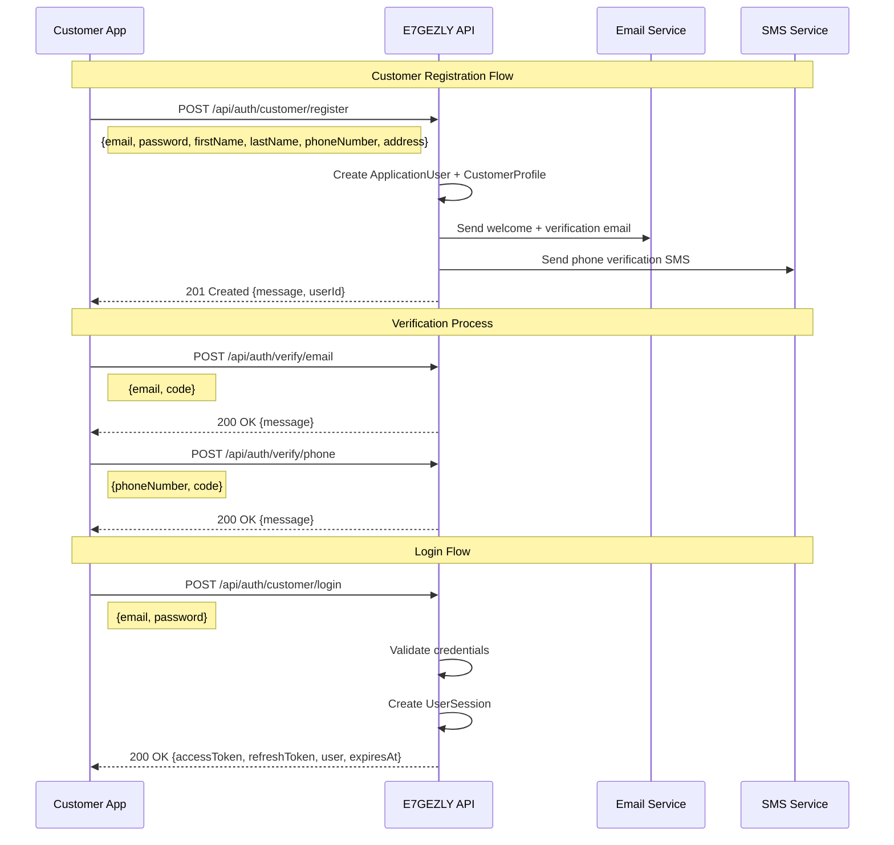
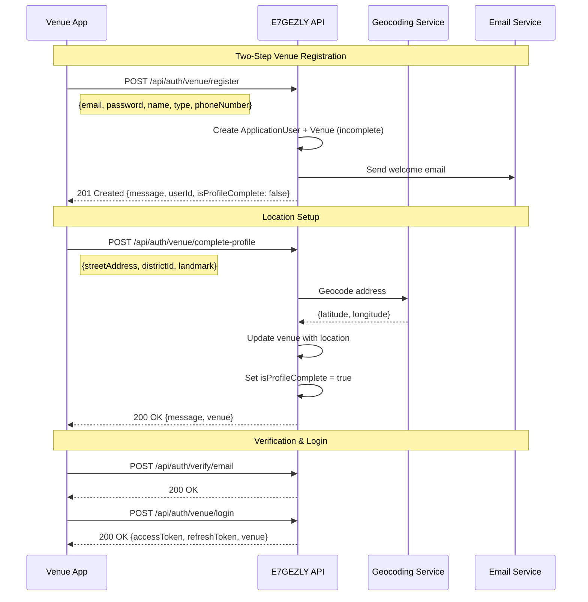
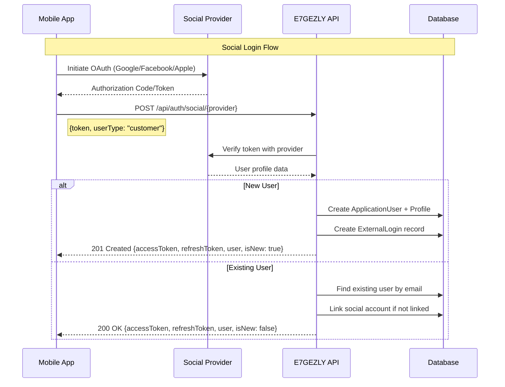
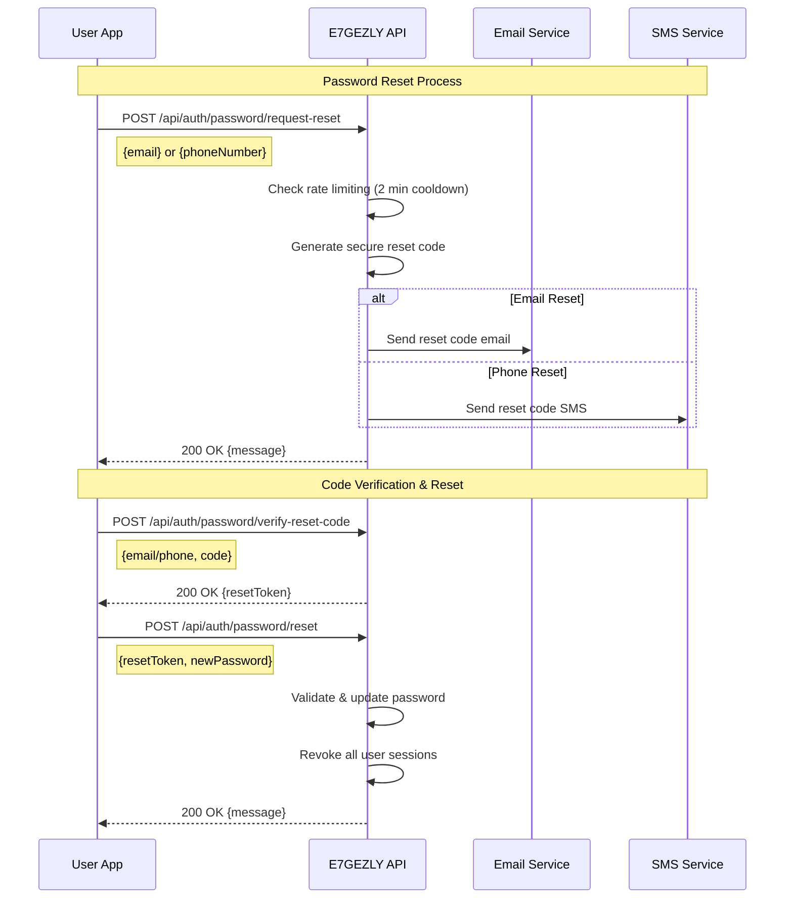

# E7GEZLY API Documentation

## Table of Contents

1. [Overview](#overview)
2. [Authentication Flows](#authentication-flows)
3. [API Endpoints](#api-endpoints)
4. [Integration Guides](#integration-guides)
5. [Error Handling](#error-handling)
6. [Rate Limiting](#rate-limiting)
7. [Testing](#testing)

## Overview

E7GEZLY (احجزلي - "Book for me") is Egypt's premier venue booking platform API. This RESTful API serves as the backend for mobile apps and desktop applications, enabling customers to book entertainment venues and venues to manage their operations.

### Base URL
- **Development**: `https://8ee12d427802.ngrok-free.app/api`(Current Mode)
- **Production**: `https://api.e7gezly.com/api`

### API Version
- **Current Version**: v1.0
- **Supported Formats**: JSON
- **Authentication**: JWT Bearer Token

### Core Concepts

- **Customers**: End users who book venues
- **Venues**: Entertainment businesses (PlayStation cafes, football courts, etc.)
- **Two-Layer Authentication**: Primary users (customers/venues) and planned venue sub-users
- **Multi-Device Sessions**: Users can be logged in on multiple devices simultaneously

---

## Authentication Flows

### Customer Registration → Verification → Login Flow



### Venue Registration → Location Setup → Verification Flow



### Social Authentication Flow



### Password Reset Flow



---

## API Endpoints

### Customer Authentication Endpoints

#### Register Customer
```http
POST /api/auth/customer/register
Content-Type: application/json

{
  "email": "customer@example.com",
  "password": "SecurePass123!",
  "firstName": "Ahmed",
  "lastName": "Mohamed",
  "phoneNumber": "01234567890",
  "dateOfBirth": "1990-01-01",
  "streetAddress": "123 Main Street",
  "districtId": 1,
  "landmark": "Near Metro Station"
}
```

**Response (201 Created):**
```json
{
  "message": "Customer registered successfully. Please verify your email and phone number.",
  "userId": "550e8400-e29b-41d4-a716-446655440000"
}
```

#### Customer Login
```http
POST /api/auth/customer/login
Content-Type: application/json

{
  "email": "customer@example.com",
  "password": "SecurePass123!"
}
```

**Response (200 OK):**
```json
{
  "accessToken": "eyJhbGciOiJIUzI1NiIsInR5cCI6IkpXVCJ9...",
  "refreshToken": "550e8400-e29b-41d4-a716-446655440000",
  "expiresAt": "2024-07-28T16:00:00Z",
  "user": {
    "id": "550e8400-e29b-41d4-a716-446655440000",
    "email": "customer@example.com",
    "phoneNumber": "+201234567890",
    "isPhoneVerified": true,
    "isEmailVerified": true
  },
  "profile": {
    "id": "profile-id",
    "firstName": "Ahmed",
    "lastName": "Mohamed",
    "dateOfBirth": "1990-01-01",
    "address": "123 Main Street, Near Metro Station",
    "district": "Maadi",
    "governorate": "Cairo"
  }
}
```

### Venue Authentication Endpoints

#### Register Venue
```http
POST /api/auth/venue/register
Content-Type: application/json

{
  "email": "venue@example.com",
  "password": "SecurePass123!",
  "name": "Champions PlayStation Cafe",
  "venueType": "PlayStation",
  "phoneNumber": "01234567890"
}
```

**Response (201 Created):**
```json
{
  "message": "Venue registered successfully. Please complete your profile setup.",
  "userId": "550e8400-e29b-41d4-a716-446655440000",
  "isProfileComplete": false
}
```

#### Complete Venue Profile
```http
POST /api/auth/venue/complete-profile
Content-Type: application/json
Authorization: Bearer {accessToken}

{
  "streetAddress": "456 Gaming Street",
  "districtId": 2,
  "landmark": "Next to Pizza Hut"
}
```

**Response (200 OK):**
```json
{
  "message": "Venue profile completed successfully",
  "venue": {
    "id": "venue-id",
    "name": "Champions PlayStation Cafe",
    "type": "PlayStation",
    "isProfileComplete": true,
    "location": {
      "latitude": 30.0444,
      "longitude": 31.2357,
      "address": "456 Gaming Street, Next to Pizza Hut",
      "district": "Nasr City",
      "governorate": "Cairo"
    }
  }
}
```

### Verification Endpoints

#### Verify Email
```http
POST /api/auth/verify/email
Content-Type: application/json

{
  "email": "user@example.com",
  "code": "123456"
}
```

#### Verify Phone Number
```http
POST /api/auth/verify/phone
Content-Type: application/json

{
  "phoneNumber": "+201234567890",
  "code": "123456"
}
```

#### Resend Verification Code
```http
POST /api/auth/verify/resend
Content-Type: application/json

{
  "type": "email", // or "phone"
  "email": "user@example.com", // or phoneNumber
  "language": "en" // or "ar"
}
```

### Token Management Endpoints

#### Refresh Token
```http
POST /api/auth/token/refresh
Content-Type: application/json

{
  "refreshToken": "550e8400-e29b-41d4-a716-446655440000"
}
```

**Response (200 OK):**
```json
{
  "accessToken": "eyJhbGciOiJIUzI1NiIsInR5cCI6IkpXVCJ9...",
  "refreshToken": "new-refresh-token-guid",
  "expiresAt": "2024-07-28T20:00:00Z"
}
```

### Account Management Endpoints

#### Get Current User Profile
```http
GET /api/auth/account/me
Authorization: Bearer {accessToken}
```

#### Get Active Sessions
```http
GET /api/auth/account/sessions
Authorization: Bearer {accessToken}
```

**Response (200 OK):**
```json
{
  "sessions": [
    {
      "id": "session-id",
      "deviceName": "iPhone 14",
      "ipAddress": "192.168.1.100",
      "userAgent": "E7GEZLY iOS/1.0",
      "lastActivity": "2024-07-28T12:00:00Z",
      "isCurrentSession": true
    }
  ],
  "totalCount": 1
}
```

#### Revoke Session
```http
DELETE /api/auth/account/sessions/{sessionId}
Authorization: Bearer {accessToken}
```

#### Logout (Current Device)
```http
POST /api/auth/account/logout
Authorization: Bearer {accessToken}
```

#### Logout All Devices
```http
POST /api/auth/account/logout-all-devices
Authorization: Bearer {accessToken}
```

#### Change Password
```http
POST /api/auth/account/change-password
Authorization: Bearer {accessToken}
Content-Type: application/json

{
  "currentPassword": "OldPass123!",
  "newPassword": "NewPass123!",
  "logoutAllDevices": true
}
```

### Social Authentication Endpoints

#### Google Sign-In
```http
POST /api/auth/social/google
Content-Type: application/json

{
  "idToken": "google-id-token-here",
  "userType": "customer" // or "venue"
}
```

#### Facebook Login
```http
POST /api/auth/social/facebook
Content-Type: application/json

{
  "accessToken": "facebook-access-token-here",
  "userType": "customer"
}
```

#### Apple Sign-In
```http
POST /api/auth/social/apple
Content-Type: application/json

{
  "identityToken": "apple-identity-token-here",
  "userType": "customer"
}
```

### Location Endpoints

#### Get Governorates
```http
GET /api/location/governorates
```

**Response (200 OK):**
```json
{
  "governorates": [
    {
      "id": 1,
      "nameEn": "Cairo",
      "nameAr": "القاهرة"
    }
  ]
}
```

#### Get Districts by Governorate
```http
GET /api/location/governorates/{governorateId}/districts
```

**Response (200 OK):**
```json
{
  "districts": [
    {
      "id": 1,
      "nameEn": "Maadi",
      "nameAr": "المعادي",
      "governorateId": 1
    }
  ]
}
```

---

## Error Handling

### Standard Error Response Format

All API errors follow a consistent format:

```json
{
  "error": "ERROR_CODE",
  "message": "Human-readable error message",
  "details": {
    "field": "Specific field error details"
  },
  "timestamp": "2024-07-28T12:00:00Z",
  "path": "/api/auth/customer/login"
}
```

### Common Error Codes

| HTTP Status | Error Code | Description |
|-------------|------------|-------------|
| 400 | `INVALID_REQUEST` | Request validation failed |
| 401 | `UNAUTHORIZED` | Invalid or missing authentication |
| 403 | `FORBIDDEN` | Insufficient permissions |
| 404 | `NOT_FOUND` | Resource not found |
| 409 | `CONFLICT` | Resource already exists |
| 422 | `VALIDATION_ERROR` | Input validation failed |
| 429 | `RATE_LIMIT_EXCEEDED` | Too many requests |
| 500 | `INTERNAL_ERROR` | Server error |

### Authentication-Specific Errors

#### Invalid Credentials
```json
{
  "error": "INVALID_CREDENTIALS",
  "message": "Invalid email or password",
  "timestamp": "2024-07-28T12:00:00Z",
  "path": "/api/auth/customer/login"
}
```

#### Account Not Verified
```json
{
  "error": "ACCOUNT_NOT_VERIFIED",
  "message": "Please verify your email address before logging in",
  "details": {
    "verificationRequired": ["email"],
    "email": "user@example.com"
  }
}
```

#### Token Expired
```json
{
  "error": "TOKEN_EXPIRED",
  "message": "Access token has expired",
  "details": {
    "expiredAt": "2024-07-28T12:00:00Z"
  }
}
```

#### Rate Limit Exceeded
```json
{
  "error": "RATE_LIMIT_EXCEEDED",
  "message": "Too many password reset requests. Please wait 2 minutes.",
  "details": {
    "retryAfter": 120,
    "nextAllowedAt": "2024-07-28T12:02:00Z"
  }
}
```

---

## Rate Limiting

### Current Rate Limits

| Endpoint Pattern | Limit | Window | Scope |
|------------------|-------|--------|-------|
| `/api/auth/password/request-reset` | 1 request | 2 minutes | Per user |
| `/api/auth/verify/resend` | 3 requests | 5 minutes | Per user |
| `/api/auth/*/login` | 5 attempts | 15 minutes | Per IP |
| `/api/auth/*/register` | 3 requests | 1 hour | Per IP |

### Rate Limit Headers

API responses include rate limiting information:

```http
X-RateLimit-Limit: 5
X-RateLimit-Remaining: 4
X-RateLimit-Reset: 1627491600
X-RateLimit-Window: 900
```

---

## Testing

### Health Check Endpoint

```http
GET /health
```

**Response (200 OK):**
```json
{
  "status": "Healthy",
  "totalDuration": "00:00:00.1234567",
  "entries": {
    "database": {
      "status": "Healthy",
      "duration": "00:00:00.0123456"
    },
    "nominatim": {
      "status": "Healthy",
      "duration": "00:00:00.0234567"
    }
  }
}
```

### Test Environment

- **Base URL**: `https://localhost:5001/api`
- **Test Database**: In-memory SQLite
- **Mock Services**: Email and SMS services return success without sending

### Swagger Documentation

Interactive API documentation is available at:
- **Development**: `https://localhost:5001/swagger`
- **Staging**: `https://staging-api.e7gezly.com/swagger`

---

## Security Considerations

### Token Security
- **Access Token**: 4-hour expiration, JWT format
- **Refresh Token**: 30-day expiration, UUID format, stored in database
- **Token Rotation**: New refresh token issued on each refresh

### Password Requirements
- Minimum 8 characters
- At least one uppercase letter
- At least one lowercase letter  
- At least one number
- At least one special character

### Session Management
- Maximum 5 active sessions per user
- Automatic cleanup of expired sessions
- Device tracking for security monitoring

### Data Protection
- HTTPS enforcement in production
- SQL injection protection via Entity Framework
- Input validation on all endpoints
- CORS configuration for allowed origins

---

*For more detailed integration examples and advanced scenarios, see the separate integration guides.*