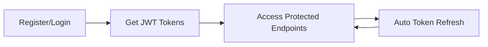

# E7GEZLY API Documentation

Welcome to the comprehensive API documentation for **E7GEZLY** (احجزلي - "Book for me"), Egypt's premier venue booking platform.

## 📚 Documentation Overview

This documentation suite provides everything you need to integrate with the E7GEZLY API:

### 🔐 [Main API Documentation](./API-Documentation.md)
Complete API reference including:
- Authentication flows with sequence diagrams
- All endpoints with request/response examples
- Error handling and rate limiting
- Security considerations

### 📱 [Flutter Integration Guide](./Flutter-Integration-Guide.md)
Comprehensive Flutter integration including:
- HTTP client setup with Dio
- Authentication service implementation
- State management with Provider
- Code examples and best practices

### 🔗 [Social Authentication Setup](./Social-Authentication-Setup-Guide.md)
Complete setup guide for social login providers:
- Google Sign-In configuration
- Facebook Login setup
- Apple Sign-In implementation
- Platform-specific configurations

### 🔄 [Multi-Device Session Handling](./Multi-Device-Session-Handling-Guide.md)
Advanced session management features:
- Multi-device authentication
- Session visibility and control
- Security considerations
- Implementation examples

## 🚀 Quick Start

### 1. Base API Information
- **Base URL**: `https://8ee12d427802.ngrok-free.app/api` (Development)
- **Authentication**: JWT Bearer Token
- **Format**: JSON

### 2. Authentication Flow


### 3. Basic Usage Example

#### Customer Registration
```http
POST /api/auth/customer/register
Content-Type: application/json

{
  "email": "customer@example.com",
  "password": "SecurePass123!",
  "firstName": "Ahmed",
  "lastName": "Mohamed",
  "phoneNumber": "01234567890"
}
```

#### Login
```http
POST /api/auth/customer/login
Content-Type: application/json

{
  "email": "customer@example.com",
  "password": "SecurePass123!"
}
```

#### Response
```json
{
  "accessToken": "eyJhbGciOiJIUzI1NiIsInR5cCI6IkpXVCJ9...",
  "refreshToken": "550e8400-e29b-41d4-a716-446655440000",
  "expiresAt": "2024-07-28T16:00:00Z",
  "user": {
    "id": "550e8400-e29b-41d4-a716-446655440000",
    "email": "customer@example.com",
    "isEmailVerified": true,
    "isPhoneVerified": true
  }
}
```

## 🏗️ API Architecture

### Clean Architecture Layers
```
┌─────────────────────────────────────────────────┐
│              Presentation Layer                  │
│          (Controllers, DTOs, Extensions)         │
├─────────────────────────────────────────────────┤
│              Application Layer                   │
│     (Services, Interfaces, Business Logic)      │
├─────────────────────────────────────────────────┤
│              Domain Layer                        │
│        (Models, Entities, Exceptions)            │
├─────────────────────────────────────────────────┤
│            Infrastructure Layer                  │
│      (Data, External Services, Migrations)      │
└─────────────────────────────────────────────────┘
```

### Key Features
- **Dual User System**: Customers and Venues
- **Multi-Device Sessions**: Simultaneous login across devices
- **Social Authentication**: Google, Facebook, Apple
- **Location Services**: Egyptian governorates and districts
- **Real-time Verification**: Email and SMS verification
- **Background Services**: Automatic session cleanup

## 🔑 Authentication System

### Two-Layer Architecture

**Layer 1: Primary Users**
- **Customers**: End users who book venues
- **Venues**: Business accounts managing their venues

**Layer 2: Venue Sub-Users** (Planned)
- **Admin Sub-Users**: Venue owners with full access
- **Shift Workers**: Staff with limited operational access

### Token Management
- **Access Token**: 4-hour expiration, JWT format
- **Refresh Token**: 30-day expiration, UUID format
- **Automatic Refresh**: Seamless token renewal
- **Multi-Device Support**: Up to 5 concurrent sessions

## 📍 Egyptian Market Features

### Location System
- **Hierarchical Structure**: Governorate → District
- **Pre-seeded Data**: All Egyptian governorates and districts
- **Geocoding Integration**: Nominatim API with caching
- **Address Validation**: Smart address formatting

### Localization
- **Bilingual Support**: Arabic and English
- **Phone Formatting**: Automatic +20 prefix for Egyptian numbers
- **Cultural Considerations**: Market-specific UX patterns

## 🛡️ Security Features

### Authentication Security
- **Password Hashing**: BCrypt via ASP.NET Identity
- **JWT Security**: Short-lived access tokens
- **Token Rotation**: Refresh tokens rotated on use
- **Session Management**: Device tracking and control

### API Security
- **HTTPS Enforcement**: All production communications
- **CORS Configuration**: Restricted origins
- **Rate Limiting**: Configurable per endpoint
- **Input Validation**: Comprehensive validation on all inputs

## 📊 Performance & Scalability

### Database Optimization
- **Indexed Queries**: Optimized foreign key relationships
- **Async Operations**: Non-blocking database calls
- **Connection Pooling**: Efficient database connections

### Caching Strategy
- **In-Memory Caching**: Geocoding results and static data
- **Response Caching**: Public endpoint optimization
- **Background Processing**: Non-blocking operations

## 🧪 Testing & Quality

### Test Coverage
- **Unit Tests**: Service layer business logic
- **Integration Tests**: API endpoint functionality
- **Test Data Factories**: Consistent test data generation
- **Mock Services**: Email and SMS service mocking

### Code Quality
- **Clean Architecture**: Proper layer separation
- **SOLID Principles**: Maintainable code structure
- **Dependency Injection**: Testable service architecture
- **Documentation**: Comprehensive XML documentation

## 🚀 Deployment

### Environment Configuration
- **Development**: Local SQL Server, mock services
- **Staging**: Full services with test data
- **Production**: Azure/AWS ready, full monitoring

### Health Monitoring
```http
GET /health
```

Returns system health status including database and external service connectivity.

## 📈 API Versioning

Current API version: **v1.0**

All endpoints are prefixed with `/api/` and follow RESTful conventions.

## 🔄 Changelog

### v1.0 (Current)
- Complete authentication system
- Customer and venue registration
- Social authentication (Google, Facebook, Apple)
- Multi-device session management
- Location services integration
- Email/SMS verification system

## 🤝 Support

### Documentation Structure
Each guide includes:
- **Overview**: Feature explanation and benefits
- **Implementation**: Step-by-step code examples
- **Best Practices**: Security and performance recommendations
- **Troubleshooting**: Common issues and solutions

### Getting Help
- Review the specific guides for detailed implementation
- Check the troubleshooting sections for common issues
- Refer to the API reference for endpoint details

## 🎯 Next Steps

### For New Developers
1. Read the [Main API Documentation](./API-Documentation.md)
2. Follow the [Flutter Integration Guide](./Flutter-Integration-Guide.md)
3. Implement authentication using the provided examples
4. Set up social authentication if needed

### For Existing Integrations
1. Review the [Multi-Device Session Handling](./Multi-Device-Session-Handling-Guide.md)
2. Implement session management features
3. Update social authentication configurations
4. Test with the provided examples

---

## 📋 File Structure

```
E7GEZLY API Documentation/
├── README.md                              # This overview file
├── API-Documentation.md                   # Complete API reference
├── Flutter-Integration-Guide.md           # Flutter implementation guide
├── Social-Authentication-Setup-Guide.md   # Social auth configuration
└── Multi-Device-Session-Handling-Guide.md # Session management guide
```

Each documentation file is comprehensive and can be used independently, while this README provides the overall navigation and quick start information.

---

**E7GEZLY** - Connecting Egypt's entertainment venues with customers through innovative technology.

*For technical support or questions about implementation, please refer to the specific guides linked above.*